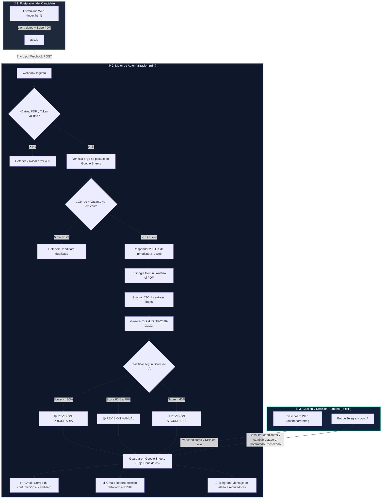

# 🚀 Sistema Inteligente de Preselección de Candidatos
### **Automatización con n8n, Google Gemini y Google Sheets · Campuslands**

[](https://n8n.io/)
[](https://ai.google.dev/)
[](https://www.google.com/sheets/about/)
[](https://telegram.org/)
[](https://mail.google.com/)
[](https://developer.mozilla.org/es/docs/Web/JavaScript)
[](https://opensource.org/licenses/MIT)

---

## 💡 ¿Qué es este proyecto y qué problema resuelve?

Cuando una empresa abre una vacante, el equipo de **Recursos Humanos** suele recibir decenas o cientos de currículums (PDFs). Revisarlos manualmente uno a uno toma horas o días, y muchas veces lo que el candidato escribe en un formulario no coincide con lo que realmente dice su hoja de vida.

Este proyecto es una **solución 100% automatizada** que:
1. **Recibe la postulación y el PDF** desde un portal web moderno.
2. **Lee y evalúa el CV con Inteligencia Artificial (Google Gemini)** de forma objetiva, sin sesgos (sin mirar fotos, género ni edad).
3. **Calcula un porcentaje de compatibilidad (0 a 100%)** comparando la experiencia y tecnologías del candidato contra los requisitos reales del puesto.
4. **Guarda todo ordenadamente en Google Sheets** (13 datos clave por candidato).
5. **Envía correos automáticos:**
   - Un correo al **candidato** con su número de ticket de seguimiento.
   - Un reporte detallado con semáforo de colores al equipo de **Recursos Humanos**.
6. **Alerta al instante por Telegram** al equipo de selección.
7. **Incluye un Bot de Telegram inteligente y un Dashboard web** para que el reclutador humano siempre tenga el control final (*Human-in-the-Loop*) y decida a quién contratar o rechazar.

---

## ⚡ Inicio Rápido en 3 Pasos (TL;DR)

```text
1. Levanta n8n e importa el archivo n8n.json
2. Conecta tus 4 credenciales (Gemini, Google Sheets, Gmail, Telegram)
3. Abre index.html en tu navegador y ¡postúlate para ver la automatización en acción!
```

---

## 📂 Estructura del Repositorio

```text
📁 Proyecto_n8n/
├── 📄 index.html              # Portal de postulación del candidato (Formulario + Upload PDF)
├── 📄 app.js                  # Lógica del cliente de postulación y validaciones
├── 📄 dashboard.html          # Panel de control de RRHH (KPIs y tabla en tiempo real)
├── 📄 dashboard.js            # Consumo de métricas, filtros y actualización de estados
├── 📄 nueva-vacante.html      # Módulo para listar y registrar nuevas vacantes
├── 📄 nueva-vacante.js        # Lógica CRUD de vacantes conectada con Google Sheets
├── 📄 styles.css              # Estilos globales unificados (Glassmorphism, Modo Claro/Oscuro)
├── 📄 n8n.json                # Workflow completo exportado listo para importar en n8n
└── 📄 README.md               # Documentación y manual técnico del proyecto
```

---

## 📑 Tabla de Contenidos

- [1. ¿Cómo Funciona el Sistema? (Arquitectura y Flujo)](#1-cómo-funciona-el-sistema-arquitectura-y-flujo)
- [2. Las 3 Pantallas de la Aplicación Web](#2-las-3-pantallas-de-la-aplicación-web)
- [3. Instalación y Despliegue Paso a Paso](#3-instalación-y-despliegue-paso-a-paso)
- [4. Configuración de Credenciales (Paso a Paso)](#4-configuración-de-credenciales-paso-a-paso)
- [5. Guía "Plug & Play": ¿Qué valores debo cambiar?](#5-guía-plug--play-qué-valores-debo-cambiar)
- [6. Explicación de los Flujos en n8n](#6-explicación-de-los-flujos-en-n8n)
- [7. Modelo de Datos (Google Sheets y JSON de IA)](#7-modelo-de-datos-google-sheets-y-json-de-ia)
- [8. Prompts de Inteligencia Artificial](#8-prompts-de-inteligencia-artificial)
- [9. Matriz de Pruebas Realizadas](#9-matriz-de-pruebas-realizadas)
- [10. Licencia y Créditos](#10-licencia-y-créditos)

---

## 1. ¿Cómo Funciona el Sistema? (Arquitectura y Flujo)

A continuación se muestra el viaje completo que hace la información desde que el candidato llena el formulario hasta que se guardan los datos y se avisa al reclutador:



---

## 2. Las 3 Pantallas de la Aplicación Web

El proyecto incluye un portal web moderno con selector de **Modo Claro / Modo Oscuro** y diseño adaptado a celulares y computadores:

| Pantalla | Archivo | ¿Para qué sirve? |
| :--- | :--- | :--- |
| **1. Portal de Postulación** | [`index.html`](./index.html) | Donde los candidatos eligen la vacante (cargada en vivo desde Google Sheets), llenan sus datos, suben su CV en PDF, aceptan la política de datos y envían su postulación. |
| **2. Dashboard de RRHH** | [`dashboard.html`](./dashboard.html) | Panel de control para los reclutadores. Muestra 5 tarjetas con métricas en tiempo real (*Total, Promedio de Score, Analizados, Aceptados y Rechazados*), barra de búsqueda y filtros. |
| **3. Creador de Vacantes** | [`nueva-vacante.html`](./nueva-vacante.html) | Panel administrativo para crear nuevas vacantes y ver la lista actual conectada directamente con Google Sheets. |

---

## 3. Instalación y Despliegue Paso a Paso

### 🛠️ Lo que necesitas tener instalado:
1. **n8n** (puedes usarlo en Docker, con Node.js o n8n Cloud).
2. **Ngrok** (para crear una URL pública segura que conecte tu web y Telegram con tu n8n local).
3. **Un navegador web** (Chrome, Edge, Firefox).

---

### Paso 1: Descargar el proyecto
Abre tu terminal y clona este repositorio:
```bash
git clone https://github.com/tu-usuario/Proyecto_n8n.git
cd Proyecto_n8n
```

---

### Paso 2: Iniciar n8n
Si usas **Docker**, puedes iniciarlo con un solo comando:
```bash
docker run -it --rm --name n8n -p 5678:5678 -v ~/.n8n:/home/node/.n8n docker.n8n.io/n8nio/n8n
```
> O si usas **npm**: ejecuta `npx n8n`.

Abre en tu navegador: `http://localhost:5678`.

---

### Paso 3: Crear tu túnel con Ngrok
Para que Google y Telegram puedan comunicarse con tu n8n local, abre otra terminal y ejecuta:
```bash
ngrok http 5678
```
Copia la dirección HTTPS que te da Ngrok (por ejemplo: `https://abcd-1234.ngrok-free.dev`).

> 💡 **Tip sobre Ngrok (Static Domain Gratuito):**
> En el plan gratuito de Ngrok, la URL aleatoria cambia cada vez que cierras la terminal. Si deseas una URL fija y permanente, puedes reclamar un **Static Domain gratuito** desde el [Dashboard de Ngrok](https://dashboard.ngrok.com/cloud-edge/domains) y ejecutarlo con:
> ```bash
> ngrok http --domain=tu-dominio-estatico.ngrok-free.app 5678
> ```

---

### Paso 4: Importar el flujo en n8n
1. En tu n8n (`http://localhost:5678`), crea un nuevo Workflow.
2. Abre el archivo [`n8n.json`](./n8n.json) de este proyecto, copia todo su contenido y pégalo directamente en el lienzo de n8n usando `Ctrl + V`.
3. ¡Verás aparecer todos los nodos organizados y conectados!
4. Haz clic en el botón superior derecho **`Save`** y activa el interruptor **`Active`**.

---

### Paso 5: Abrir la página web
Puedes abrir directamente el archivo `index.html` en tu navegador, o servir la carpeta con un servidor local simple:

```bash
# Con Python:
python -m http.server 8000

# Con Node.js:
npx serve . -p 8000
```
Entra en tu navegador a:
* 💼 **Postularse:** `http://localhost:8000/index.html`
* 📊 **Dashboard:** `http://localhost:8000/dashboard.html`
* ➕ **Nueva Vacante:** `http://localhost:8000/nueva-vacante.html`

---

## 4. Configuración de Credenciales (Paso a Paso)

En n8n, ve a **Settings ──> Credentials** y agrega las siguientes 4 conexiones:

```
┌─────────────────────────┬─────────────────────────────────────────────────────────────┐
│ Credencial              │ ¿Dónde se consigue y cómo se configura?                    │
├─────────────────────────┼─────────────────────────────────────────────────────────────┤
│ 1. Google Gemini API    │ 1. Entra a https://aistudio.google.com/                     │
│                         │ 2. Haz clic en "Get API key" y cópiala.                     │
│                         │ 3. En n8n, crea una credencial Google Gemini y pega la clave│
├─────────────────────────┼─────────────────────────────────────────────────────────────┤
│ 2. Google Sheets OAuth2 │ 1. Entra a https://console.cloud.google.com/                │
│                         │ 2. Habilita "Google Sheets API" y "Google Drive API".       │
│                         │ 3. Crea tus credenciales OAuth2 y autoriza tu cuenta.       │
├─────────────────────────┼─────────────────────────────────────────────────────────────┤
│ 3. Gmail OAuth2         │ 1. En Google Cloud Console, habilita "Gmail API".           │
│                         │ 2. Agrega el permiso para enviar correos (gmail.send).      │
│                         │ 3. Conecta el correo institucional que enviará los avisos.  │
├─────────────────────────┼─────────────────────────────────────────────────────────────┤
│ 4. Telegram API         │ 1. Abre Telegram y escribe a @BotFather.                    │
│                         │ 2. Escribe /newbot y dale un nombre a tu bot.               │
│                         │ 3. Copia el token que te da y pégalo en la credencial de n8n│
└─────────────────────────┴─────────────────────────────────────────────────────────────┘
```

---

## 5. Guía "Plug & Play": ¿Qué valores debo cambiar?

Para que el proyecto funcione con **tus propias cuentas y URLs**, solo debes cambiar estos datos puntuales:

### 🌐 1. En los archivos JavaScript del Frontend:
Abre los archivos [`app.js`](./app.js), [`dashboard.js`](./dashboard.js) y [`nueva-vacante.js`](./nueva-vacante.js), y al inicio cambia la `baseUrl` por tu URL de Ngrok:

```javascript
const N8N_CONFIG = {
  // 👉 Cambia esto por tu URL de Ngrok:
  baseUrl: 'https://tu-subdominio.ngrok-free.dev',
  webhooks: {
    postulacion: '/webhook/7f6f1634-9472-4fcb-a3b5-a3e055c9b8f4',
    listarVacantes: '/webhook/3a9f40c0-aa9c-4151-8cde-cd3fca0e4a4e',
    crearVacante: '/webhook/7ade266f-9b3a-48e9-b47e-c755c23932a1'
  },
  debug: true
};
```

---

### ⚙️ 2. En los nodos de n8n:

| Nodo en n8n | Campo a editar | ¿Qué debes poner? |
| :--- | :--- | :--- |
| **Nodos de Google Sheets** | `Document ID` | Pega el **ID de tu propia hoja de Google Sheets** (los caracteres largos que están en la URL de tu hoja). |
| **Notificacion RRHH** | `To Email` (`sendTo`) | Pon **tu correo electrónico** para que recibas el reporte de cada candidato. |
| **Enviar a Telegram** | `Chat ID` | Pon tu **Chat ID de Telegram** (consíguelo escribiendo a [@userinfobot](https://t.me/userinfobot)). |

---

## 6. Explicación de los Flujos en n8n

El archivo [`n8n.json`](./n8n.json) contiene 4 flujos principales trabajando en conjunto:

### 1️⃣ Flujo de Postulación
* **Validador de Seguridad:** Comprueba que no falte ningún campo obligatorio, que venga el PDF adjunto y que el token de seguridad coincida.
* **Filtro Antiduplicados:** Si el mismo correo ya se postuló a esa misma vacante, frena el proceso educadamente para no saturar la base de datos.
* **Evaluación con Gemini Flash:** La IA lee el documento PDF y devuelve en milisegundos un JSON estructurado con la experiencia real y el score.
* **Semáforo de Compatibilidad:**
  - 🟢 **Score >= 80%:** `RECOMENDADO PARA REVISIÓN PRIORITARIA`
  - 🟡 **Score 60% a 79%:** `REVISIÓN MANUAL`
  - 🔴 **Score < 60%:** `REVISIÓN SECUNDARIA`
* **Persistencia y Avisos:** Inserta las 13 columnas en Google Sheets, envía el correo con el ticket al candidato, envía el reporte con diseño HTML a RRHH y manda la alerta a Telegram.

---

### 2️⃣ Flujo del Dashboard
* Al abrir el dashboard web, este flujo lee todas las filas de la hoja `Candidatos` en Google Sheets, limpia los datos y los envía a la página web en formato JSON para calcular los KPIs al instante.

---

### 3️⃣ Flujo de Gestión de Vacantes
* Permite que tanto el formulario de postulación como el panel administrativo lean y registren vacantes directamente en la hoja `Vacantes` de Google Sheets.

---

### 4️⃣ Bot de Telegram con Inteligencia Artificial (HITL)
* El reclutador puede hablarle en lenguaje natural al bot de Telegram:
  - 💬 *"¿Qué candidatos tengo pendientes?"* o escribir `/pendientes`.
  - 💬 *"Muéstrame la información de TF-2026-433"* o escribir `/candidato TF-2026-433`.
  - 💬 *"Pasa a Maria Paola a Contratado"*: El bot actualizará **únicamente** la columna de revisión en Google Sheets sin alterar ningún otro dato.

---

## 7. Modelo de Datos (Google Sheets y JSON de IA)

### 1. Hoja `Candidatos` en Google Sheets (13 Columnas)
| # | Columna | ¿Qué guarda? | Ejemplo |
| :-: | :--- | :--- | :--- |
| **1** | `ID_Candidato` | Ticket único generado | `TF-2026-433` |
| **2** | `Nombre` | Nombre del postulante | `Eidan Cuadros` |
| **3** | `Correo` | Correo de contacto | `eidan@ejemplo.com` |
| **4** | `Telefono` | Teléfono | `+57 300 123 4567` |
| **5** | `Vacante` | Código de la vacante | `backend-junior` |
| **6** | `Experiencia` | Años verificados en el PDF | `2` |
| **7** | `Habilidades` | Tecnologías encontradas | `Python, Django, SQL, Git` |
| **8** | `Nivel_Educativo` | Grado académico | `Técnico en Sistemas` |
| **9** | `Score_Compatibilidad`| Porcentaje de afinidad | `85` |
| **10** | `Estado` | Clasificación inicial | `RECOMENDADO PARA REVISIÓN PRIORITARIA` |
| **11** | `Fecha_Postulacion` | Fecha y hora exacta | `2026-08-14 20:30:00` |
| **12** | `Observaciones_IA` | Resumen técnico | `Cumple con los requisitos del perfil.` |
| **13** | `Revision_RRHH` | **Decisión humana final** | `Contratado` / `Rechazado` / `Sin revisar` |

---

### 2. Hoja `Vacantes` en Google Sheets (5 Columnas)
| # | Columna | Descripción |
| :-: | :--- | :--- |
| **1** | `Vacante` | Título del puesto (Ej: *Desarrollador Backend Junior*) |
| **2** | `Código` | Identificador único (Ej: `backend-junior`) |
| **3** | `Tecnologías` | Requisitos técnicos clave |
| **4** | `Experiencia` | Experiencia requerida (Ej: `0-2 años`) |
| **5** | `Nivel_Mínimo` | Formación mínima (Ej: `Técnico`) |

---

### 3. Estructura JSON que devuelve Gemini:
```json
{
  "experiencia_anios": 2,
  "habilidades": ["Python", "Django", "PostgreSQL", "Git"],
  "nivel_educativo": "Técnico en Programación",
  "compatibilidad": 85,
  "resumen_perfil": "Candidato con sólida experiencia en desarrollo backend.",
  "preguntas_entrevista": [
    "¿Cómo organizas la arquitectura de una API en Django?",
    "¿Has trabajado con bases de datos PostgreSQL en producción?"
  ],
  "observaciones": "Cumple los requisitos técnicos exigidos para la posición."
}
```

---

## 8. Prompts de Inteligencia Artificial

### Prompt 1: Evaluación del CV en PDF con Gemini

```text
Eres un asistente de Recursos Humanos especializado en analizar hojas de vida.

Se te adjunta un documento PDF que corresponde a la hoja de vida del candidato.
Analiza su contenido para extraer información objetiva y verificable, sin hacer juicios de valor ni inferencias no soportadas por el texto.

Reglas obligatorias:
1. Solo debes basarte en la información presente en el documento PDF adjunto.
2. No debes inventar datos que no estén explícitamente mencionados.
3. No debes utilizar como criterio de análisis: género, edad, fotografía, estado civil, nacionalidad, religión, orientación sexual, discapacidad u otras características personales protegidas.
4. El "compatibilidad" debe calcularse comparando las habilidades y experiencia detectadas en el CV contra los requisitos de la vacante proporcionados, y debe ser un número entero entre 0 y 100.
5. Si existe diferencia entre lo declarado en el formulario y lo encontrado en el CV adjunto, prioriza siempre la información respaldada por el documento PDF.
6. Responde ÚNICAMENTE con un objeto JSON válido, sin texto adicional, sin explicaciones, sin markdown ni bloques de código.

Datos de la postulación:
- Vacante: {{ $('Postularse').item.json.body.vacante }}
- Experiencia declarada: {{ $('Postularse').item.json.body.experiencia }} años
- Habilidades declaradas: {{ $('Postularse').item.json.body.habilidades }}

Requerimientos por vacante:
- backend-junior: Java o Python, Spring Boot o Django, SQL, PostgreSQL, APIs REST, Git. Experiencia: 0-2 años. Nivel mínimo: Técnico.
- frontend-junior: HTML, CSS, JavaScript, React o Vue.js, diseño responsive, Git. Experiencia: 0-2 años. Nivel mínimo: Técnico.
- fullstack-node: JavaScript, Node.js, Express, React o Angular, PostgreSQL o MongoDB, APIs REST, Git. Experiencia: 1-3 años. Nivel mínimo: Tecnólogo.
- analista-datos: Python, SQL, Excel avanzado, Power BI o Tableau, estadística básica, Git. Experiencia: 0-2 años. Nivel mínimo: Técnico.
- automatizacion-n8n: n8n, APIs REST, JavaScript básico, integración de servicios, SQL, Git. Experiencia: 1-2 años. Nivel mínimo: Técnico.
- qa-tester-junior: Selenium, Postman, JavaScript básico, SQL, Git, metodologías de testing manual y automatizado. Experiencia: 0-1 año. Nivel mínimo: Técnico o Tecnólogo en desarrollo de software.

Formato de salida obligatorio (JSON):
{
  "experiencia_anios": number,
  "habilidades": string[],
  "nivel_educativo": string,
  "compatibilidad": number,
  "resumen_perfil": string,
  "preguntas_entrevista": string[],
  "observaciones": string
}
```

---

### Prompt 2: Agente de Telegram (Human-in-the-Loop)

```text
Eres el Asistente Inteligente de Recursos Humanos de Campuslands.
Tu misión es gestionar consultas, actualización de estados de candidatos y administración de vacantes consultando y ejecutando OBLIGATORIAMENTE las herramientas de Google Sheets disponibles.

HERRAMIENTAS DISPONIBLES:
- "Buscar Candidatos": úsala para CUALQUIER consulta, búsqueda o listado de candidatos (por ID, nombre, o para listar varios). Es de SOLO LECTURA. Úsala siempre primero.
- "Consultar Candidatos": úsala ÚNICAMENTE cuando el usuario pida explícitamente MODIFICAR la columna "Revision_RRHH" de un candidato. Requiere el Nombre exacto del candidato y el nuevo valor de Revision_RRHH.
- "Consultar Vacantes": úsala para ver las vacantes disponibles y sus requisitos.
- "Crear Vacante": úsala para registrar una nueva vacante en la hoja de cálculo.

INSTRUCCIONES DE OPERACIÓN:
1. COMANDO /pendientes:
   - Llama a "Buscar Candidatos".
   - Filtra los que tengan Revision_RRHH vacío o "Sin revisar".
   - Muestra la lista con Nombre, ID, Vacante, Score y Resumen.
2. COMANDO /candidato <ID>:
   - Busca por ID y muestra la ficha completa con habilidades y score.
3. ACTUALIZAR ESTADO DE UN CANDIDATO:
   - Si el usuario dice "Pasa a Eidan a Contratado" o "Rechaza a Maria":
   - Usa "Consultar Candidatos" y modifica ÚNICAMENTE la columna Revision_RRHH.
   - Confirma la acción al usuario de forma clara.
```

---

## 9. Matriz de Pruebas Realizadas

Todas las funcionalidades del sistema fueron probadas y verificadas con éxito:

| Prueba | ¿Qué se probó? | ¿Qué debía pasar? | Estado |
| :---: | :--- | :--- | :---: |
| **TC-01** | Postulación con perfil afín | Score >= 80%, guarda en Sheets, manda emails y alerta en Telegram | ✅ **FUNCIONAL** |
| **TC-02** | Postulación con perfil bajo | Score < 60%, clasifica como Revisión Secundaria sin borrarlo | ✅ **FUNCIONAL** |
| **TC-03** | Postular dos veces el mismo correo a la misma vacante | n8n detecta el duplicado y rechaza el segundo registro | ✅ **FUNCIONAL** |
| **TC-04** | Intentar enviar formulario sin PDF | El formulario y n8n bloquean el envío y piden el PDF obligatorio | ✅ **FUNCIONAL** |
| **TC-05** | Escribir `/pendientes` en Telegram | El bot responde con la lista formateada de candidatos sin revisar | ✅ **FUNCIONAL** |
| **TC-06** | Cambiar estado a *"Contratado"* en Telegram | El bot actualiza la celda en Google Sheets en tiempo real | ✅ **FUNCIONAL** |
| **TC-07** | Ver Dashboard de RRHH | Los KPIs calculan las métricas en vivo y los filtros funcionan al instante | ✅ **FUNCIONAL** |

---

## 10. Licencia y Créditos

* **Proyecto:** Sistema Inteligente de Preselección de Candidatos
* **Institución:** Campuslands · Departamento de Gestión de Talento
* **Desarrollador:** Eidan Cuadros
* **Tecnologías:** n8n, Google Gemini AI, Google Sheets API, Telegram Bot API
* **Año:** 2026